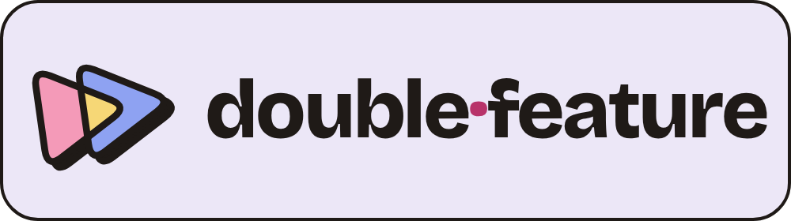
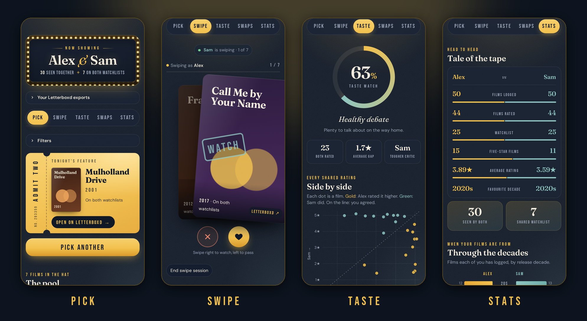

# Double Feature

**Two Letterboxd accounts, one movie night.**

Double Feature compares two people's Letterboxd data and helps them pick something to watch together. It's built for phones, with a bright, playful look and your choice of background colour.

👉 **[Open the app](https://double-feature.streamlit.app/)**



---

## What it does

| Tab | What you get |
| --- | --- |
| **Pick** | Films on both your watchlists. Tap the button and it picks one at random, printed on a ticket. Filters let you add films one of you rated 4★+ that the other wants to see, or narrow it down by decade, length, genre or streaming service. |
| **Swipe** | Like a dating app, but for films. You each swipe through the same deck on your own phones, and the first film you both swipe right on is tonight's film. |
| **Taste** | Your taste-match score, a chart of every film you've both rated (tap a dot to see which film it is), the films you both loved and your biggest disagreements. |
| **Swaps** | Films one of you rated highly that the other hasn't seen yet. |
| **Stats** | A head-to-head comparison: films logged, average rating, favourite decade and how you each hand out stars. |

There's also a **Group night** mode for more than two people. Everyone brings a few films, everyone swipes, and the most-wanted film wins.

On top of that:

- **Film details:** each film shows its length and genre, and **where it's streaming** in your country.
- **Settings:** tap **Settings** at the top to pick a background colour (Lavender, Butter, Blush or Periwinkle) or **Dark**, choose minimal poster art or the films' real posters, and set your streaming country. The app goes dark on its own when your phone is in dark mode, unless you switch that off. Your choices are remembered on that phone.
- **Share:** a **Share** button turns tonight's pick, your match, your taste-match score or the group winner into an image for WhatsApp or Instagram.

## How to use it

### 1. Export your Letterboxd data

Go to **[letterboxd.com/settings/data](https://letterboxd.com/settings/data)** and click **Export your data**. You'll get a `.zip` file.

> The export is only available on the Letterboxd **website**, not in the phone app. On a phone, open the site in your browser.
>
> In the app, **"How do I get my Letterboxd export?"** has a button that opens the export page directly, plus an illustrated walkthrough.

### 2. Pair up

**Two phones (the default)**

1. One of you opens the app, uploads your export and taps **Get a pair code**.
2. Send the other person the link or the four-letter code.
3. They open it, upload their own export, and both phones load the full app.

**One phone**

Upload both exports on one phone. You can still start a swipe session from the Swipe tab, and the other person joins it on their phone with the code.

### Group night 🍿

Hosting friends? Pick **Group night** on the start screen.

1. The host taps **Host a movie night** and shares the code or link.
2. Everyone joins on their own phone and brings 5–10 films. Make a Letterboxd list of what you'd watch, export your data (after making the list), then upload the export and pick that list. If two people bring the same film, it only shows up once.
3. The host starts the vote and everyone swipes through the combined pile. Everyone gets **one super-like ★**, which counts double.
4. The film with the most votes wins, and you get a shortlist of the top five. If it's a tie or you want to narrow it down, the host can run a quick run-off on the top few.

### Tips

- If your export got unzipped, upload `watched.csv`, `ratings.csv` and `watchlist.csv` instead of the zip.
- Names are optional. If you leave yours blank, the app uses the name on your Letterboxd profile.
- To try it out on your own, choose **One phone** and upload your export into both boxes.
- If someone refreshes the page during a pairing, they just open the same link again and tap their name.
- The streaming country is set from your browser. You can change it under **Settings**.

## Privacy

- Nothing is written to disk or stored in a database.
- Uploads are held in the app's memory only for your session. When you pair or swipe across two phones, they're kept for up to 12 hours so the other phone can load them. Restarting the app clears everything.
- Straight after upload, the app throws away everything except your watched films, ratings, watchlist and profile name. Your email address, reviews, comments and diary notes from the export are never kept.
- To look up film details, only a film's title and year are sent to TMDB. Nothing about you is sent.

## Film details setup (for whoever runs the app)

Film details, real posters and streaming info come from [TMDB](https://www.themoviedb.org). They need a free API key. Without one, the app works exactly the same, just without those extras.

1. Make a free account at themoviedb.org, then go to **Settings → API** and request an API key (choose "Developer", personal use).
2. On [share.streamlit.io](https://share.streamlit.io), open the app's **⋮ menu → Settings → Secrets** and add:

   ```toml
   TMDB_API_KEY = "paste-your-key-here"
   ```

   Either the short "API Key" or the long "API Read Access Token" works.
3. Save. The app restarts with film details switched on.

To run it locally with details, put the same line in `.streamlit/secrets.toml`. Never commit that file to GitHub.

## Running it locally

You'll need Python 3.10 or newer.

```bash
git clone https://github.com/tysgreen/double-feature.git
cd double-feature
python -m pip install -r requirements.txt
python -m streamlit run app.py
```

It opens in your browser. To try it on a phone on the same Wi-Fi, use the **Network URL** printed in the terminal.

## How it works

- **One file:** the whole app is in `app.py`, built with [Streamlit](https://streamlit.io) (1.64+), pandas, Altair and Pillow.
- **Matching:** films are matched across accounts by title and year. Anything you've rated counts as seen.
- **Taste match:** 100% minus the average rating gap on films you've both rated, scaled so a full 4.5★ gap would be 0%.
- **Posters:** the export has no images, so each film gets a generated screen-print-style poster based on its title. Share images redraw the same poster with Pillow.
- **Film details:** films are looked up on TMDB by title and year. Details are cached in memory for a week, and if TMDB is unreachable the app stops asking for 10 minutes.
- **Pairing and swiping:** rooms live in server memory (`st.cache_resource`) under a four-letter code. Both phones check for changes every couple of seconds. The swipe cards are a small custom component (`st.components.v2`) that supports dragging and buttons.
- **Sharing:** uses the phone's own share sheet where it's available, otherwise the image downloads.
- **Look and colours:** `.streamlit/config.toml` sets the light base theme. The background colours and dark mode are CSS variables the app swaps in per person, and the choice is saved in the phone's browser storage (nothing is sent anywhere).
- **Logo:** two play buttons overlapping, in the two people's colours (pink and blue) with the overlap in butter. The header draws it as an SVG in the current theme's colours; `static/favicon.png` is the browser-tab icon, `static/apple-touch-icon.png` is the home-screen icon, and `static/share/logo-mark.png` goes on share images.
- **Fonts:** Bricolage Grotesque (SIL Open Font License, see `static/share/OFL-bricolage.txt`) is served from `static/`, with TTF copies in `static/share/` for drawing share images. The `fallback-*` fonts are trimmed copies of DejaVu Sans and DejaVu Serif, used for names and titles with letters Bricolage doesn't have (Greek, Cyrillic and so on).

```
├── app.py
├── requirements.txt
├── .streamlit/
│   └── config.toml
└── static/
    ├── bricolage.woff2
    ├── bricolage-ext.woff2
    ├── favicon.png
    ├── apple-touch-icon.png
    ├── logo.png
    └── share/
        ├── bricolage-500.ttf
        ├── bricolage-700.ttf
        ├── bricolage-800.ttf
        ├── logo-mark.png
        ├── OFL-bricolage.txt
        ├── fallback-sans.ttf
        └── fallback-serif.ttf
```

## Limitations

- On Streamlit Community Cloud, the app goes to sleep after 12 hours without visitors. The first person back sees a "wake up" button and waits about a minute.
- Pairings and swipe sessions last up to 12 hours and are lost if the app restarts, for example after an update.
- Matching on title and year can occasionally mix up two films with the same name and year, and the TMDB lookup can occasionally pick the wrong film for very obscure titles.

---

Not affiliated with or endorsed by Letterboxd. Film data comes from your own Letterboxd export.

This product uses the TMDB API but is not endorsed or certified by TMDB. Streaming availability data is provided by JustWatch.
